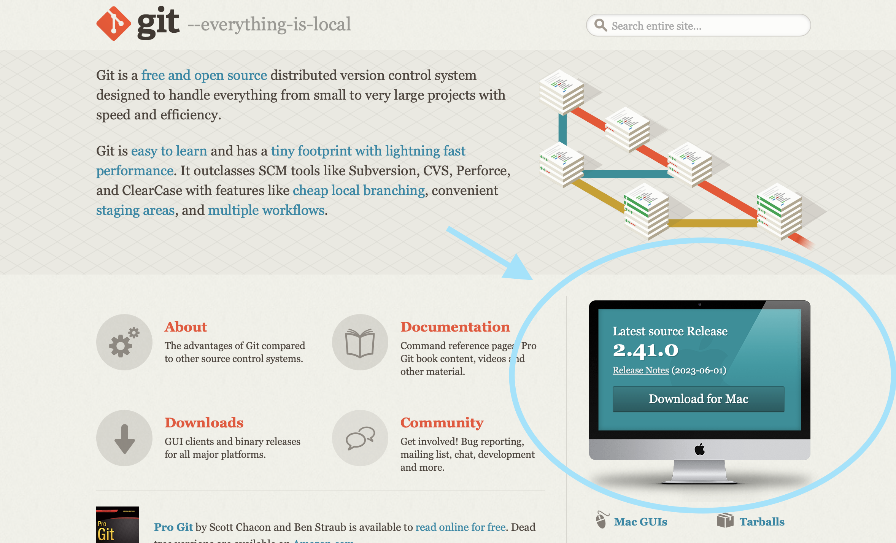

# LangChain with GPT demo website

*You may need the following api keys:
> * pinecone vector database to store your documents <br>
> * OpenAI Api keys to use llm chains <br>
> * serpapi keys to search for web informations

## Start, init
> The repo is https://github.com/neo1202/LangChain_GPT.git

Install git (optional, you can just download zip by pressing the green button 'Code')

https://git-scm.com


Install node package manager(npm)

https://nodejs.org/zh-tw


After installing the prerequisites, open a new terminal

1. Go to Desktop
```
cd ~/Desktop
```
2. Clone the repository from Github
```
git clone https://github.com/neo1202/LangChain_GPT.git
```
3. Go into the repo
```
cd LangChain_GPT
```


## Frontend --- _React, tailwind_


Go to the client folder
```
cd client
```
Install the packages using npm
```
npm install
```

run this code, so you can open website [http://localhost:8080](http://localhost:8080) to view it in browser.
```
npm run dev
```


## Backend --- _Python - Flask_
Open a new terminal and go to the server folder
 ```
 cd flask-server
 ```
 
#### Create a config file and place your api keys in it, only when you first clone this repo

The Touch command is not already pre-installed in Windows. Execute the “npm install touch-cli -g” command
```
touch config.py
```
Put your Api keys in it
```python
OPEN_API_KEY = "your_api_key_here"
SERP_API_KEY = "your_serpapi_key"
PINECONE_KEY = "your_pinecone_key"
```
 

Create virtual environment for depencies
 ```
 python -m venv .venv
 ```
Activate the virtual environment in your terminal
##### windows
```
.\.venv\Scripts\activate
```
##### mac
```
. .venv/bin/activate 
```

Install the depencies for this .venv
```
pip install -r requirements.txt
```

*run this code to active the backend server*
```
python -m flask run
```

the server runs at [http://127.0.0.1:5000/](http://127.0.0.1:5000/) <br>
you can visit [http://127.0.0.1:5000/data](http://127.0.0.1:5000/data) to see some msg to ensure you successfully open the server.
#  Website appearance

# How the LangChain work ?
Langchain flow Chart using all in one Agent

## Tool
Tool - Doc retrieval and answer base on given information

### Agent with Tools:
Agent concept (reAct paper) -> reason & acting, use given tool to gain more knowledge


### Usecase
Suppose I have 32 cages, and each cage has seven chickens. (Math Chain)

Other tool in practice


# Feature Display
*上網搜尋資料並總結 \ 內部文件*

*上傳電腦內文件功能（可選資料夾 or 1~多個檔案)*

*自帶的寫程式、翻譯功能，並且會有前幾輪對話的記憶*

*依照網址搜尋Youtube影片並照字幕進行總結*

